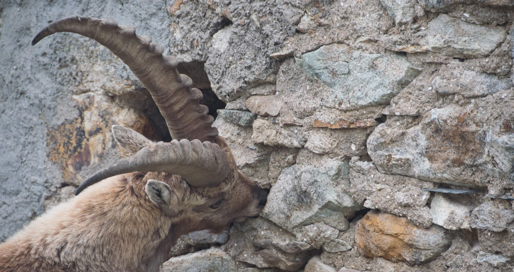
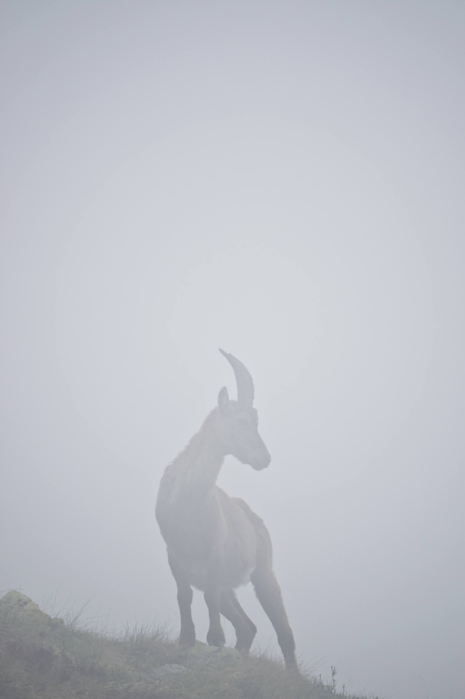
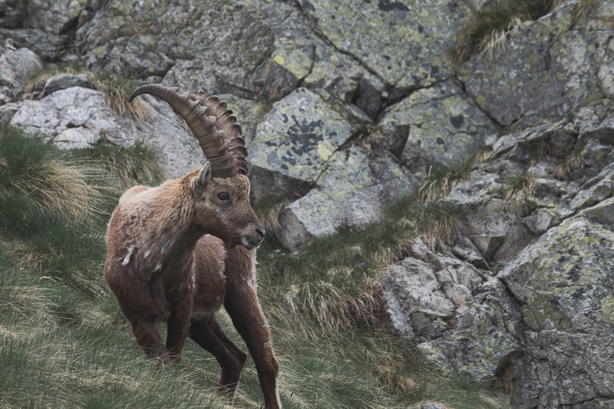
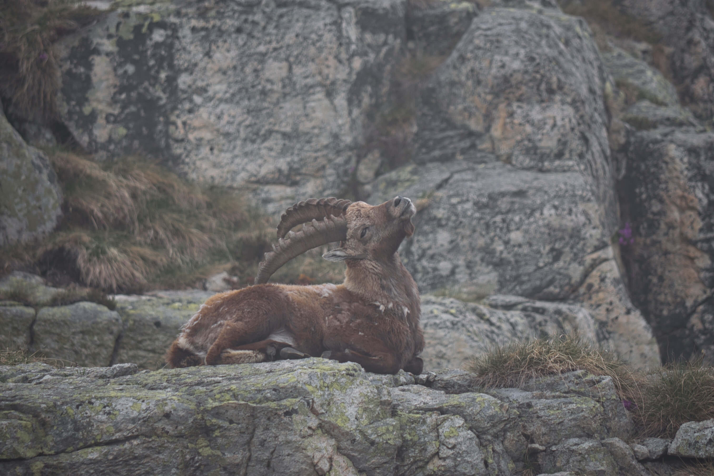
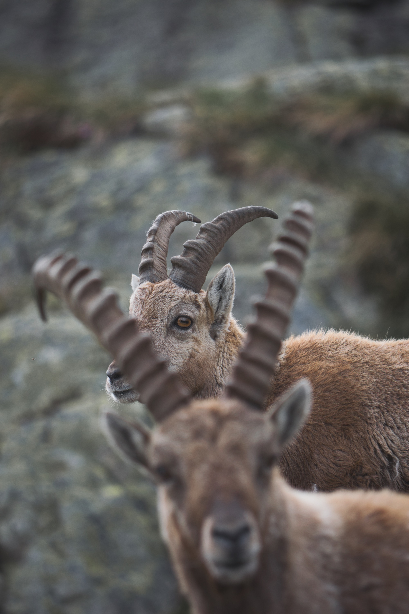

+++
title = "The Alpine Ibex"
date = "2021-05-05"
description = "Known as Stambecco in Italian, can be considered the emblem of the Italian Alps"
categories = [
    "creativity",
    "science"
]
tags = [
    "photo gallery",
    "alpine ibex",
    "italian alps"
]
image = "main.jpeg"
+++

Historically present in Central Europe rocky regions, starting from the 16th century through the 19th century, due to overexploitation and poaching, the alpine ibex (*Capra ibex*) [became extirpated in most areas](https://www.sciencedirect.com/science/article/abs/pii/016815919190262V). Remaining populations left in the western Italian Alps around the Gran Paradiso and Vanoise massifs. After the Gran Paradiso was made into a [national park](http://www.pngp.it/) in 1922, resulting in ibexes being protected from poaching, their populations grew in surrounding areas, repopulating Italian and French alpine ranges, southern Germany, Switzerland and Austria, mainly thanks to reintroductions. 

Today the alpine ibex is not threatened, being considered of Least Concern by the International Union for Conservation of Nature ([IUCN](https://www.iucn.org/)).

---

Alpine ibexes are strictly herbivorous and need to integrate mineral salts into their diet, for this reason are often observed licking stones while [risking their lives](https://www.mentalfloss.com/article/80269/see-how-alpine-ibex-defies-gravity-all-lick-salt), or approaching mountain huts since salt is often scattered by their visitors. As shown here below.

This is the reason why I got the chance to observe them from close distance when I visited the *Baita Lago Nero* in Valgoglio in the province of Bergamo, a mountain hut located at around 2000 meters above sea level.  

    <iframe src="https://www.google.com/maps/embed?pb=!1m18!1m12!1m3!1d3608.9874537401315!2d9.87504621602699!3d45.99717167911095!2m3!1f0!2f0!3f0!3m2!1i1024!2i768!4f13.1!3m3!1m2!1s0x4783ee6157337679%3A0x4dd9088727ef1d59!2sRifugio%20Lago%20Nero!5e1!3m2!1sit!2sit!4v1620221608430!5m2!1sit!2sit" width="500" height="250" style="border:0;" allowfullscreen="" loading="lazy"></iframe>

This altitude corresponds to the snow line in the spring, where ibexes tend to live in this season. A period when males and females are usually not found together, as ibexes tend to segregate sexually and spatially depending on the different seasons. From December to February, during the mating season, females and males live in mixed-sex groups and by May, adults tend to separate. 

The following photographs capture a small group of males wandering near the aforementioned mountain hut.

 

 

